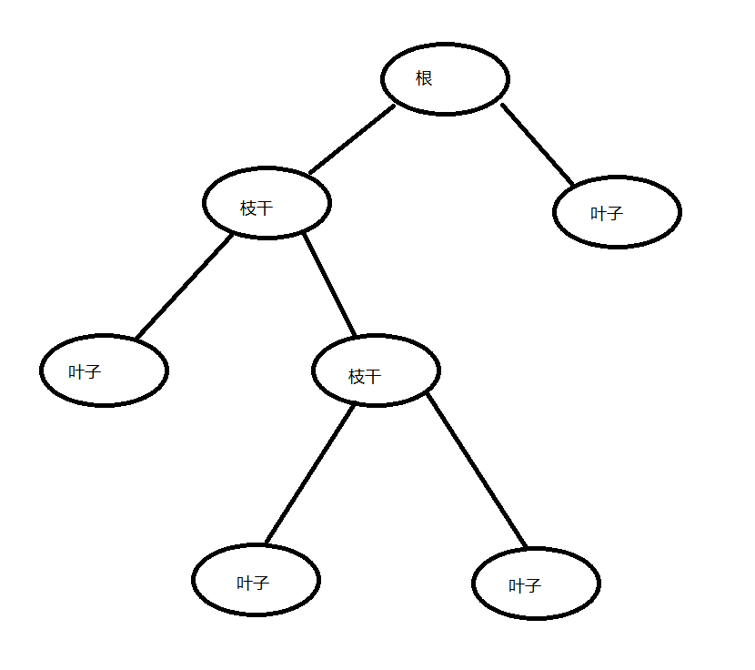
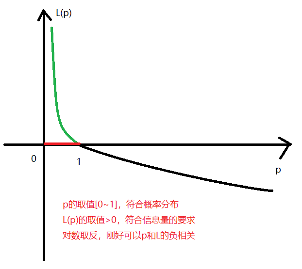

---
export_on_save:
 html: true
---

# 决策树 Decision Tree

女："你身高多少？"

男："168"

女："那你学历是啥？"

男："211"

女："一个月工资多少了？"

男："月薪3千5"

女："有车，有房，有存款吗？"

男："..."

女："不好意思，家里漏水了，我得赶紧回去了"

女孩买完单，走了

第18次了...

男孩沉默了几秒，打开手机，快速翻找浏览器浏览记录，打开了一篇文章："决策树"

## 1. 你好，决策树

我们还是举起一个栗子来说下什么是决策树算法。
最近在尝试基金投资，作为一个小萌新，抱着下海捞金的美好愿景，最近两个月内，不断的为祖国的发展贡献了自己的微末力量。嗯~ 我自豪~ 我骄傲

话归正题。买卖基金的过程中，波段涨跌预测应该是能否盈利的决定性条件。当你通过大盘涨跌情况，北向资金净流入，基金估值区间高还是低，长期看好情况等等，判断你今天是卖出止盈还是继续加仓。如果创建一个树状图，把每一个判断条件当做枝干来看，结果作为叶子，那么这个树状图就可以看做是一个决策树。

决策树算法，就是要通过一定排序的条件判断之后，逐步得到一个确定的结果。

## 1.2 构造

## 1.2.1 树节点介绍

决策树的树节点包含三个类型：
1. 根节点
2. 枝节点
3. 叶节点

上图展示的是树的根节点，枝节点，叶节点

现在树的构成了解了，那么考虑下面的三个问题？
1. 选择哪个条件做根节点？
2. 根节点之后的枝节点怎么选择？
3. 叶子节点表示的是什么？

还是以猜基金涨跌为例，详细说一下咱们划分节点。

| 大盘涨跌 | 北向资金 | 估值区间 | 长期看好 | 涨跌情况 |
|   ---    |   ---    |   ---    |   ---   |   ---    |
| 上涨 | 流入 | 中 | 好 | 涨 |
| 上涨 | 流入 | 高 | 差 | 跌 |
| 上涨 | 流出 | 中 | 好 | 跌 |
| 横盘 | 流入 | 低 | 好 | 涨 |
| 横盘 | 流入 | 高 | 差 | 跌 |
| 横盘 | 流出 | 高 | 差 | 跌 |
| 横盘 | 流出 | 低 | 好 | 跌 |
| 下跌 | 流入 | 高 | 好 | 涨 |
| 下跌 | 流出 | 低 | 好 | 跌 |

上面的数据纯属瞎编乱造的，举例只为更好的说明决策树的构造。

首先，问题(3)是很好确定的。猜涨跌，那么算法最后输出的肯定也是涨跌，所以[涨跌情况]就是决策树的叶子节点。

接下来，我们要决定数据中剩下的四个条件，哪个是根节点？然后怎么选择枝节点？

问题(1),(2)其实都是通过一个标准去判断的：纯度和信息熵。

纯度与结果的关系：纯度越高，结果越确定。
信息熵与结果的关系：熵越高，结果越不确定。
纯度和信息熵的关系，就类似二分类中两个分类的概率，一个大，那么另一个就小。

陈旸老师的课中，有句话描述的特别清晰：构造决策树的过程就是寻找纯度划分的过程。也就是说，构造一个决策树，就是要逐步提纯，让决策树的叶子节点的纯度达到最高，那么叶子节点代表的结果也就越确定。结果越确定，算法是不是就更好，这个也符合我们对算法的要求，算法最终需要输出一个确定的结果才是好的算法。

### 1.2.2 信息熵

熵的概念，是由香浓提出的，在通信领域所描述的是：消息所含信息量的大小与事件发生的概率的关系。

消息描述的是大概率事件，那么他包含的信息量就小，信息熵就小；
消息描述的是小概率事件，那么他包含的信息量就大，信息熵就大。

比如：国足世界杯夺冠了。小概率事件，信息量太大了...，是不是就意味着这个结果不太确定。

信息量的公式：
$$L(x) = -\log_2{p(x)}$$

信息量与概率是负相关，并且信息量大于0，所以采用对数函数计算信息量。

信息熵的公式：
$$H(x) = -\sum_{i=1}^n{p(x^i) \times \log_2{p(x^i)}}$$

信息熵就是信息描述的n个方向发生的概率乘以n个方向的信息量的总和。

*** 重点理解 ***

1. 如果直接对预测结果计算信息熵，那么信息熵应该是最大的
2. 当选择一个特征值之后，在计算信息熵，那么信息熵会减小
3. 决策树在选择节点的时候，会选择信息熵减小程度最大的特征
4. 信息熵减小程度 = 信息增益 = 原来的信息熵 - 选择条件之后的信息熵
5. 增加一个特征值，相当于加了个一个判断条件，那么信息熵就会减小，结果就越确定

*** 重点理解 ***

### 1.2.3 亲手载一棵树

我们以选择决策树根节点为例，详细计算一次。

1. 根节点也就是选择的第一个特征值，要选择信息增益最大的特征值作为根节点。

2. 计算没有选择特征值的时候，涨跌结果的信息熵a:
$$a = -(\frac{3}{9}) \times \log_2{\frac{3}{9}}-(\frac{6}{9}) \times \log_2{\frac{6}{9}} = 0.528 + 0.396 = 0.924$$

3. 分别计算[大盘涨跌][北向资金][估值区间][长期看好]这些条件的信息熵：

如果选择[大盘涨跌]作为根节点，那么他会有三个分支：上涨，横盘，下跌。假设用+表示涨，-表示跌，那么[大盘涨跌]与[涨跌结果]数据可以表示如下：

D1_1(大盘涨跌=上涨) = {1+, 2-, 3-}
D1_2(大盘涨跌=横盘) = {4+, 5-, 6-， 7-}
D1_3(大盘涨跌=下跌) = {8+, 9-}

D1_1情况的信息熵: $b1 = -(\frac{1}{3} \times \log_2{\frac{1}{3}}) -(\frac{2}{3} \times \log_2{\frac{2}{3}}) = 0.528 + 0.396 = 0.924$
D1_2情况的信息熵: $b2 = -(\frac{1}{4} \times \log_2{\frac{1}{4}}) -(\frac{3}{4} \times \log_2{\frac{3}{4}}) = 0.5 + 0.311 = 0.811$
D1_3情况的信息熵: $b3 = -(\frac{1}{2} \times \log_2{\frac{1}{2}}) -(\frac{1}{2} \times \log_2{\frac{1}{2}}) = 0.5 + 0.5 = 1$

[大盘涨跌]的信息熵：
$$
\begin{aligned}
D1 &= p(D1)*b1 + p(D2)*b2 + p(D3)*b3\\\\
&= \frac{3}{9} \times 0.924 + \frac{4}{9} \times 0.811 + \frac{2}{9} \times 1\\\\
&= 0.888
\end{aligned}
$$

同样的方式计算其他三个条件的信息熵:
$$
\begin{aligned}
D2 &= \frac{5}{9} \times 0.442 + \frac{4}{9} \times 0 = 0.246\\\\
D3 &= \frac{4}{9} \times 0.811 + \frac{2}{9} \times 1 + \frac{3}{9} \times 0.924 = 0.891\\\\
D4 &= \frac{6}{9} \times 0.924 + \frac{3}{9} \times 0 = 0.611\\\\
\end{aligned}
$$

那么选择四个特征值的信息增益分别是：
$$
\begin{aligned}
H1 = a - D1 = 0.924 - 0.888 = 0.036\\\\
H2 = a - D2 = 0.924 - 0.246 = 0.674\\\\
H3 = a - D3 = 0.924 - 0.891 = 0.033\\\\
H4 = a - D4 = 0.924 - 0.611 = 0.313\\\\
\end{aligned}
$$

可以看到H2最大，所以我们选择[北向资金]作为根节点。
同样的选择方式，去选择[北向资金]流入和流出两个分支的子节点分别是什么。

    
## 2. ID3, C4.5, CART

上面一节按照信息增益构建的数就是ID3算法。

ID3算法的优点是构建简单，好理解；缺点是倾向选择方向较多的属性作为节点。

针对以上的缺点，提出了C4.5算法。C4.5算法以信息增益率为依据选择节点，当一个特征的属性类型较多的时候，信息增益比较大，但是他的信息熵也大，信息增益率等于信息增益除以属性熵，所以信息增益率未必是最大的。

可以类比基金的收益和收益率。

A: 今天收益1000大洋，挺不错

B一听，也说到：哈哈，我今天收益1300

A: 我投入了1w，收益率达到了10%，已经达到我的收益预期了

B尴尬一笑：那你挺厉害啊，我投入了10w，收益率才1.3%

这个类比应该就是信息增益和信息增益率的对比。所以C4.5算法解决了ID3算法的确定。同时也做了其他的一些优化：
1. 采用悲观减枝，降低拟合效果，防止过拟合
2. 可以将连续值离散化，自动选择信息增益最高的理想划分
3. 采用了一个非空值概率，来处理缺失值

ID3和C4.5只能做分类算法，CART树算法既可以做分类，也可以做预测。

CART树是基于基尼系数来选择节点的。

我们对三种树做一个归纳：
|     | 节点选择 | 任务 | 优点 | 缺点 |
| --- | --- | ---  | ---  | --- |
| ID3  | 信息增益   | 分类       | 构造简单，解释性强 | 倾向选择属性较多的特征值作为节点 |
| C4.5 | 信息增益率 | 分类       | 1. 解决ID3的缺点； 2. 悲观剪枝，防止过拟合； 3. 可以处理连续值； 4. 可以处理属性缺失值 | 构造算法复杂，运算量大 |
| CART | 基尼系数   | 分类，回归 | 既可以处理分类问题，也可以处理回归问题 | |

## 3. 不要为了一棵树，放弃整片森林

## 4. GBDT的演化
