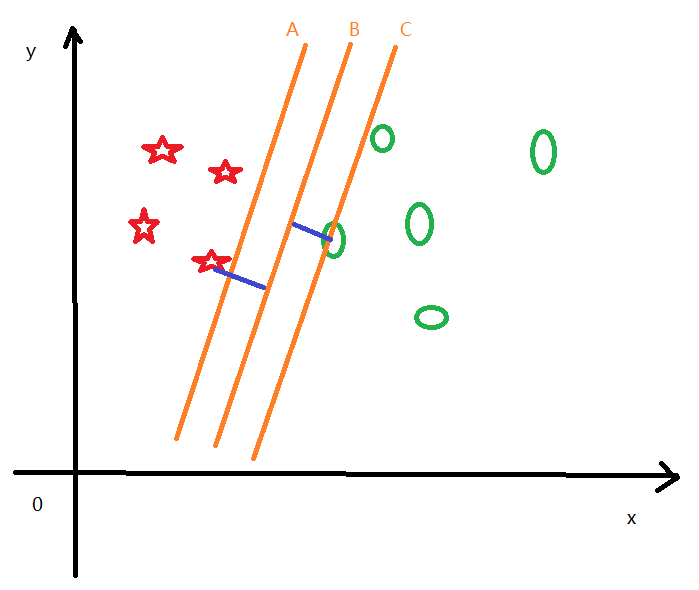
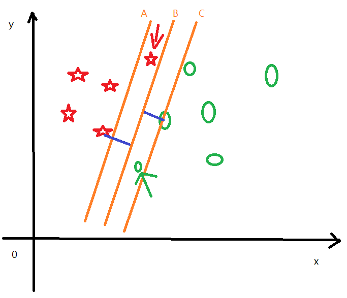
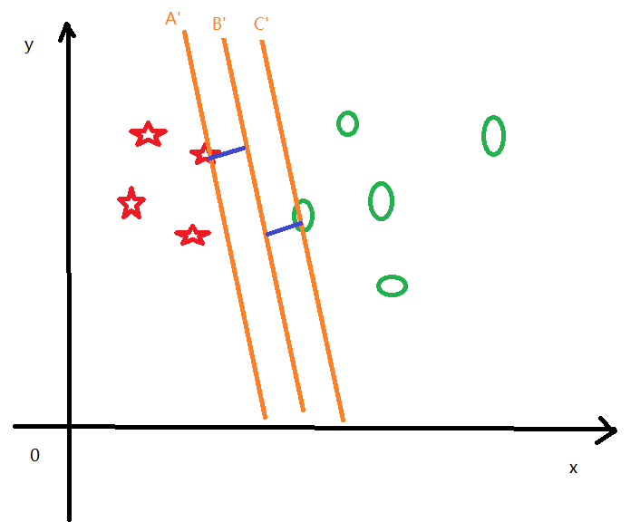
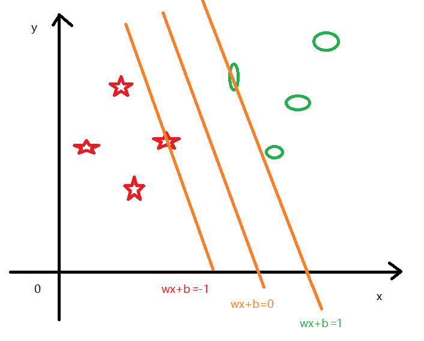

---
export_on_save:
 html: true
---

# 支持向量机 SVM

SVM算法是有监督学习算法，可以做分类任务，也可以做回归任务。

## 1. 初识SVM

对于新事物的认识过程，都是由简入繁，算法的学习同样如此。我们可以从简单的二维分类任务着手，逐步理解SVM的推演过程。

下图展示的是平面中的两个分类的数据分布，我们可以用一条直线将两个分类区分开来。

图中分别有A, B, C三条直线，他们都可以将分类正确区分开，那么哪条直线是最理想的区分直线呢？

很明显是直线B，因为样本点到直线B的距离是最大的。假设如果新加入的样本点出现在A的右侧或者C的左侧的时候，那么A和C就可能出现分类错误。

这里我们引入两个概念：决策面，分类间隔。

上面实例中，B就表示的决策面，分类样本中离决策面最近的点到决策面的距离就是分类间隔。

如果我们把决策面按照某一点进行旋转，那么我们可以得到很多决策面，同时这些决策面对应的最近的样本点也会发生变化，下图展示的就是另外一个决策面的情况。

可以看出来，B'是此时的决策面，他同样可以把两个分类区分开。同时，他对应的分类间隔也发生了变化(蓝色线段所代表的的就是分类间隔)。既然决策面有很多个，那么我们怎么去判定哪个决策面是最优决策面呢？

我们可以根据点到面的距离来判定的，也就是分类间隔判定。分类间隔越大，说明最近的样本点离决策面越远，分类效果越好。

上面的一步步推理之后，把分类问题就转换为一个求分类间隔最大化的数学问题。那么这个求解分类间隔最大化的过程就是SVM算法计算的过程。

# 2. 分类间隔最大化

SVM算法主要是求解分类间隔最大化的参数，那么具体的数学公式是什么呢？

超平面公式：
$$g(x) = W^T{x_i} + b$$

点到超平面的距离公式（这里使用的是欧氏距离）：
$$b_i = \frac{|W^T{x_i} + b|}{||W||}$$

公式中的||w||代表的是向量L2范数，这个距离也称为几何距离。

针对范数，这里简单说明一下：
L0范数：向量中非0的元素个数；
L1范数：向量中元素的绝对值之和；
L2范数：向量中元素的平方和，然后开平方。

我们知道点到超平面的距离公式之后，需要最大化这个距离。那么我们根据下图分析一下。

观察上图可以得到分类正确的情况下，样本点都需要满足下面的条件：
$$
\begin{cases}
W^T{x_i} + b \geq y_i, &y_i = 1 &(1)\\\\
W^T{x_i} + b \leq y_i, &y_i = -1 &(2)
\end{cases}
$$

上面的两个公式，可以合并到一起，下面合并到一起的这个公式，就是约束样本点被正确分类的约束条件：
$$(W^T{x_i} + b)y_i \geq 1$$

支持向量(每个分类的极限样本点)满足下面的公式：
$$
\begin{cases}
W^T{x_i} + b = y_i, &y_i = 1 &(1)\\\\
W^T{x_i} + b = y_i, &y_i = -1 &(2)
\end{cases}
$$

上面的两个公式，可以推导出：
$$|W^T{x_i} + b| = (W^T{x_i} + b)y_i$$

将上面的公式带入距离公式bi:

$$bi = \frac{(W^T{x_i} + b)y_i}{||W||}$$

分类1的极限位置样本x1：$W^T{x_1} + b = y1 = 1$；
分类2的极限位置样本x2：$W^T{x_2} + b = y2 = -1$。

分类1的距离公式: $b_1 = \frac{1}{||W||}$
分类2的距离公式: $b_2 = \frac{1}{||W||}$

求分类间隔最大化，就是支持向量样本点(极限位置样本点)到划分超平面的距离之和最大:
$$max(b_1 + b_2) = max(\frac{2}{||W||}) = min(\frac{1}{2}||W||^2)$$

总结上面的内容，可以把SVM求最优超平面的问题描述为带有约束条件的优化问题：
$$
\begin{cases}
&min(\frac{1}{2}||W||^2)\\\\
&1 - (W^T{x_i} + b)y_i \leq 0
\end{cases}
$$

目前，我们确定需要求解最小值的原函数：
$$f(x) = \frac{1}{2}||W||^2$$

## 3.拉格朗日乘子法与KKT条件

公式：
$$L(x, \alpha, \beta)=f(x) + \sum_{i=1}^m{\alpha_i{h_i(x)} + \sum_{j=1}^n{\beta_j{g_j(x)}}}$$

KKT条件：
$$
\begin{cases}
\Delta_x{L(\alpha, \beta, x)} = 0\\\\
\beta_j{g_j(x)} = 0\\\\
h_i(x) = 0\\\\
g_j(x) \leq 0\\\\
\beta_j \geq 0
\end{cases}
$$

满足KKT条件，可以利用拉格朗日乘子法将上面带有约束条件的优化问题，转换为无约束条件的优化问题：
$$L(x, \beta) = \frac{1}{2}||W||^2 + \sum_{i=1}^m{\beta_i(1-(W^T{x_i} + b)y_i)}$$

那么最大化L(x, \beta)，最终可以得到$f(x) = \max_{\beta} L(x, \beta)$，下面是推导过程：
$$
\begin{aligned}
\max_{\beta} L(x, \beta) &= \max_{\beta} (\frac{1}{2}||W||^2 + \sum_{i=1}^m{\beta_i(1-(W^T{x_i} + b)y_i)})\\\\
&= \frac{1}{2}||W||^2 + \max_{\beta}{\sum_{i=1}^m{\beta_i(1-(W^T{x_i} + b)y_i)}}\\\\
&= \frac{1}{2}||W||^2\\\\
&= f(x)
\end{aligned}
$$

OK, 那么到这里我们可以把原函数f(x)和拉格朗日乘子法函数$L(x, \beta)$联系了起来:
$$f(x) = \max_{\beta} L(x, \beta)$$

那么原函数f(x)的拉格朗日对偶函数：
$$D(\beta) = \min_{x} L(x, \beta)$$

那么原问题的对偶问题：
$$\max_{\beta}{\min_x{L(x, \beta)}} = \max_{\beta}{D(\beta)}=d^*$$

同时我们列出原问题：
$$\min_x{f(x)} = p^*$$

现在有两种情况：
1. 当对偶是弱对偶性时，满足$d^* \leq p^*$;
2. 当对偶是强对偶性时，满足$d^* = p^*$。

在SVM中直接假设满足的是强对偶问题，所以我们可以通过求解对偶问题的极值，即为原问题的极值。

## 4. 求解对偶问题的极值

拉格朗日函数分别对w和b求偏导：
$$\Delta_w{L(w, b, \beta)} = w - \sum_{i=1}^m{\beta_ix_iy_i} = 0$$
$$\Delta_b{L(w, b, \beta)} = \sum_{i=1}^m{\beta_iy_i} = 0$$

将$w=\sum_{i=1}^m{\beta_ix_iy_i}$带入$L(w,b,\beta)$得到：
$$
\begin{aligned}
L(w,b,\beta) &= \frac{1}{2}{(\sum_{i=1}^m{\beta_i{x_i}^Ty_i}\sum_{i=1}^m{\beta_i{x_i}y_i})} + \sum_{i=1}^m\beta_i(1-((\sum_{i=1}^m{\beta_i{x_i}^Ty_i})x_i+b)y_i)\\\\
&= \frac{1}{2}{(\sum_{i=1}^m{\beta_i{x_i}^Ty_i}\sum_{i=1}^m{\beta_i{x_i}y_i})} + \sum_{i=1}^m{\beta_i} - \sum_{i=1}^m{\beta_i}(\sum_{i=1}^m{\beta_i{x_i}^Ty_i})x_iy_i - \sum_{i=1}^m{\beta_iby_i}\\\\
&= \sum_{i=1}^m{\beta_ix_i^Ty_i}(\frac{1}{2}\sum_{i=1}^m{\beta_ix_iy_i} - \sum_{i=1}^m{\beta_ix_iy_i}) + \sum_{i=1}^m{\beta_i} - \sum_{i=1}^m{b\beta_iy_i}\\\\
&= \sum_{i=1}^m{\beta_i} - \frac{1}{2}\sum_{i=0}^m\sum_{j=0}^m{\beta_i\beta_jx_i^Tx_jy_iy_j}
\end{aligned}
$$

## 参考资料：
1. [拉格朗日乘子与KKT条件](https://www.cnblogs.com/ooon/p/5721119.html)
2. [拉格朗日对偶问题](https://www.cnblogs.com/ooon/p/5723725.html)