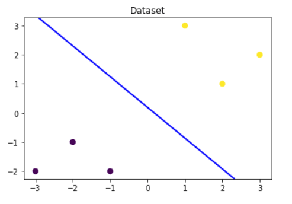
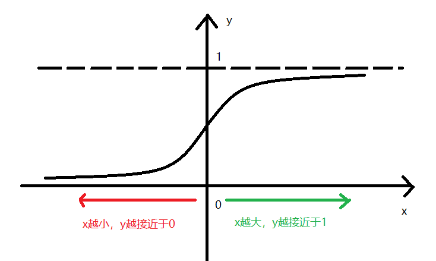
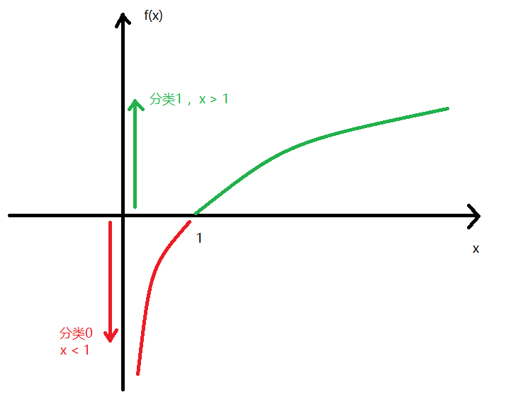
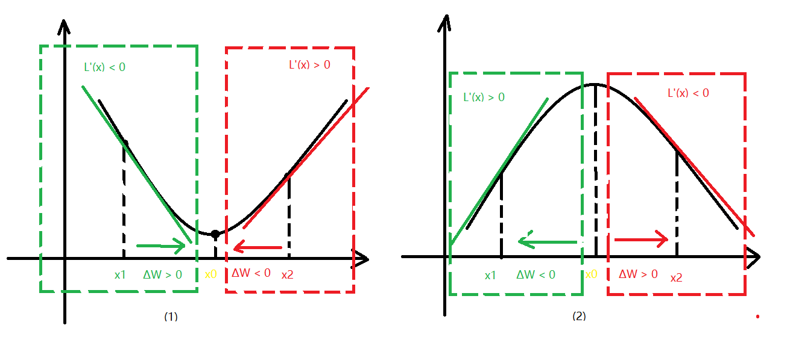

---
export_on_save:
 html: true
---

# 逻辑回归 Logistic Regression

逻辑回归算法是做分类任务的，并且通常用于二分类任务。也可以使用多个逻辑回归算法组合起来做多分类预测。

## 1. 逻辑回归的理解

逻辑回归的分类预测分为两个步骤：
1. 拟合决策边界，找到线性回归函数f(x)
2. f(x)对输入x做预测，结果做归一化处理，求得概率

### 1.1 拟合决策边界

我们通过天池实验室的[机器学习算法（一）: 基于逻辑回归的分类预测]('https://developer.aliyun.com/ai/scenario/9ad3416619b1423180f656d1c9ae44f7')中的3.1 Demo实践章节来理解一下上面的两个步骤。

首先展示一下样本分布，以及用来分类的决策边界。

```
# 数据样本，分类标签只有0和1，特征值两个x1, x2
x_fearures = np.array([[-1, -2], [-2, -1], [-3, -2], [1, 3], [2, 1], [3, 2]])
y_label = np.array([0, 0, 0, 1, 1, 1])
```



上图中，紫色点为分类0，黄色点为分类1。假设一个函数：
$$f(x) = w0 + w1 \times x1 + w2 \times x2$$
那么对于新样本有下面两种情况(忽略样本点落在f(x)上的情况)：

1. 当f(x) > 0时，样本点会落在蓝色线的上方，也就是分类为1；
2. 当f(x) < 0时，样本点会落在蓝色线线的下方，也就是分类为0。

那么函数f(x) = 0就是本次分类试验的决策边界。

当我们把一个函数通过训练样本，最终拟合成决策边界函数，那么通过这个函数对新输入样本x的输出，就可以作为分类判断的依据。这个过程也就是开始时候说的逻辑回归第一个步骤：拟合决策边界，找到线性回归函数f(x)。

### 1.2 归一化

既然通过第一个步骤就可以对样本进行分类了，那么为什么还需要对上面线性回归的结果做归一化呢？有下面几个原因：

1. 线性回归预测的值f(x) ∈ R, 是连续的；但是分类的预测结果却是0和1，是离散的；
2. 线性回归预测的值f(x)，只能表示属于哪个分类。归一化之后的结果可以当做分类概率，更好的阐释分类结果。

逻辑函数中的归一化采用了sigmoid函数：
$$g(z) = \frac{1}{1 + e^{(-z)}}$$
$$z = f(x)$$

sigmoid函数又叫做s型函数，如下图：



从图中观察，我们可以得到：
当x越大，y值越趋近于1；如果把这里的x换做线性回归的预测值的话，就是预测值越大，通过sigmoid得到的概率越接近于1，这个概率就是P(y=1)的概率；
当x越小，y值越趋近于0；也就是说线性回归的预测值越小，通过sigmoid得到的概率越小，P(y=1)越小，那么P(y=0)越大。

所以，通过sigmoid函数做归一化的结果符合我们的预期，函数值在0~1之间，可以很好的洽和概率的分布。

那么最终的预测模型为：
$$y = \frac{1}{1 + e^{-(w0 + w1 \times x1 + w2 \times x2)}}$$

上面的分析是从一个简单的二分类问题，引出决策边界的概念，然后在将线性回归的结果通过sigmoid函数转换为概率输出。

### 1.3 逻辑回归的数学认知

分类如果从概率角度看，可以设定分类为1的概率是y, 那么分类为0的概率就是1-y。y称为正例概率，1-y称为反例概率。他们两者的比值被称为几率o：
$$o = \frac{y}{1-y}$$

从公式就可以看出来：
1. 当样本分类为1的时候，y > 1-y，几率o > 1;
2. 当样本分类为0的时候，y < 1-y，几率o < 1;

函数中有一类函数，输入x正好是以1为分界线，输出y发生了正负变化，这类函数就是对数函数。上面的几率就可以认为是对数函数的输入，样本的分类就可以认为是对数函数的输出。



已知条件：

$$
\begin{aligned}
y &= \frac{1}{1 + e^{-k}}\\\\
k &= w0 + w1 \times x1 + w2 \times x2\\\\
\end{aligned}
$$

对数几率函数做推导：

$$
\begin{aligned}
\ln\frac{y}{1-y} &= \ln{y} - \ln(1-y)\\\\
&=-\ln({1+e^{-k}}) - \ln({1-\frac{1}{1+e^{-k}}})\\\\
&=-\ln({1+e^{-k}}) - \ln{e^{-k}} + \ln({1+e^{-k}})\\\\
&=-\ln{e^{-k}}\\\\
&=k
\end{aligned}
$$

对数几率函数最终的推导结果，其实就是决策边界函数，从这里也可以看出来，决策边界函数输出的结果正负情况对应的就是分类的结果1和0.

## 2. 逻辑回归函数求参

这个部分讨论的其实就是怎么从给定的训练样本，求对数几率函数的参数问题。也就是说逻辑回归模型是怎么训练的？

在机器学习中，求解最优解问题，有一个比较通用的模式是：
1. 假设一个模型函数，初始化一套参数
2. 针对模型函数，提出他的损失函数
3. 求损失函数最小时候的参数，也就是模型的最优解

上面的这个过程，在线性回归和逻辑回归中是通用的，不同的地方在于损失函数是不一样的。接下来我们逐步分析一下模型函数，损失函数，以及求最优解。

### 2.1 模型函数

首先列出逻辑回归模型函数的公式：

$$
y'=
\begin{cases}
P(y=1|x),&y = 1\\\\
1-P(y=1|x),&y = 0 \\\\
\end{cases}
$$

y' 表示预测值，y表示真实值，P(y=1|x)表示输入x输出y=1的概率

语言描述就是，当预测值y' = y = 1的时候，输出的概率P(y=1|x)；当预测值y' = y = 0的时候，输出的概率1-P(y=1|x)。

这个公式可以做一个变形，写成一个方程式：

$$y' = P(y=1|x)^{y} \times (1-P(y=1|x))^{1-y}$$

上面推敲的公式，是针对一个样本求概率然后进行分类预测。假设样本数量是m，那么对每一个样本求概率的公式如下：

$$
\begin{aligned}
&y^{'1} = P(y^{1}=1|x^{1})^{y^{1}} \times (1-P(y^{1}=1|x^{1}))^{1-y^{1}}\\\\
&y^{'2} = P(y^{2}=1|x^{2})^{y^{2}} \times (1-P(y^{2}=1|x^{2}))^{1-y^{2}}\\\\
&{\cdots}&\\\\
&y^{'i} = P(y^{i}=1|x^{i})^{y^{i}} \times (1-P(y^{i}=1|x^{i}))^{1-y^{i}}\\\\
\end{aligned}
$$

### 2.2 损失函数

当模型函数确定之后，我们可以求得每一个样本的预测概率$y^{i}$。如果想要考量模型函数的好坏程度，那么是不是应该有一个函数去描述这个好坏标准？而且这个函数需要考虑的是整个样本空间预测的好坏，而不是单个样本的好坏？

把所有样本的预测概率进行如下公式的累乘：

$$L = \prod_{i=1}^{m}y'^{i} = \prod_{i=1}^{m}{P(y^{i}=1|x^{i})^{y^{i}} \times (1-P(y^{i}=1|x^{i}))^{1-y^{i}}}$$

这个公式就可以表示了整体预测的好坏，这里的感觉类似当多个独立事件同时发生时的概率，就是联合概率。联合概概率公式：
$P(a, b, c) = P(a) \times P(b) \times P(c)$

公式L的值越大，说明模型函数预测结果越准确；反之，L的值越小，说明模型函数预测结果越不准确。

运用极大似然估计的方式，我们需要估计出公式L最大的时候，模型的参数w是什么。所以：

$$
\begin{aligned}
&p(x) = P(y^{i}=1|x^{i})\\\\
&L(w) = \prod_{i=1}^{m}{p(x)^{y^{i}} \times (1-p(x))^{1-y^{i}}}\\\\
\end{aligned}
$$

利用对数运算法则（乘积转和）简化似然函数L(w):

$$
\begin{aligned}
\ln L(w) &= \ln \prod_{i=1}^{m}{p(x)^{y^{i}} \times (1-p(x))^{1-y^{i}}}\\\\
&= \sum_{i=0}^{m}{\ln p(x)^{y^{i}} + \ln (1-p(x))^{1-y^{i}}}\\\\
&= \sum_{i=0}^{m}{y^i\ln p(x) + (1-y^i)\ln (1-p(x)))}\\\\
&= \sum_{i=0}^{m}{y^i\ln{\frac{p(x)}{1-p(x)}} + \ln{(1-p(x))}}\\\\
&= \sum_{i=0}^{m}{y^i \times wx + \ln{(1 - \frac{1}{1 + e^{-wx}})}}\\\\
&= \sum_{i=0}^{m}{y^i \times wx + \ln{(\frac{e^{-wx}}{1+e^{-wx}})}}\\\\
&= \sum_{i=0}^{m}{y^i \times wx - \ln{(\frac{1+e^{-wx}}{e^{-wx}})}}\\\\
&= \sum_{i=0}^{m}{y^i \times wx - \ln{(1+e^{wx})}}\\\\
\end{aligned}
$$

对数似然函数最终推导，成为关于输入w参数的一个函数。逻辑回归中使用了平均对数似然函数作为损失函数：

$$J(w)=-\frac{1}{m}\ln{L(w)}$$

当似然函数最大化时，损失函数最小化，所以公式中加了一个负号。


### 2.3 求最优解

损失函数确定之后，分类问题就可以转换为求函数最优解的数学问题。我们要通过迭代计算，不断的更新模型函数的参数，另损失函数找到最小值。

求最优解的方法有很多，比如梯度下降法，牛顿法，拟牛顿法等等，我们从最基础的梯度下降法了解求最小值的过程即可。

### 2.3.1 梯度下降流程

首先说一下求最优解的过程：

1. 可以先假设一个函数作为模型函数f(x)，并给参数初始化一个值
2. 找到关于假设函数的参数的损失函数J(w)，计算损失是多少
3. 通过损失函数导数更新参数，重新计算损失
4. 一直重复执行2,3两步，直至达到指定的迭代次数或者损失小于指定的值的时候，停止迭代

```
# 伪代码，便于理解
for(i=0; i<iteration_num; i++){
    # 更新参数
    Wi = Wi-1 + ∆W
    # 求J(w)
    J(w) = ...
    # 判断损失是否满足条件
    if(J(w) < j) break;
}
```

上面过程中的模型函数，损失函数我们已经都确定了，现在只需要知道怎么更新参数W就可以实现逻辑回归算法了。更新参数W的问题，可以等价求${\delta}w$，也就是怎么确定参数的变化，可以另损失函数不断的朝最小化的方向移动呢？

这个时候就引出了梯度的概念，梯度就是函数变大最快的方向，那么函数变小最快的方向就是梯度的负方向。

梯度表示的就是函数的一阶导数，所以：

$$
\begin{aligned}
W_i &= W_{i-1} + {\delta}w\\\\
&= W_{i-1} - L^{'}(w)\\\\
&= W_{i-1} - {\alpha}L^{'}(w)\\\\
\end{aligned}
$$

然后引入一个控制因子${\alpha}$，最终更新公式：
$$W_i = W_{i-1} - {\alpha}L^{'}(w)$$

控制因子又被称为学习率，通过学习率可以控制每一次迭代改变参数的大小。

对学习率有一个简单的认识就是：

1. 当${\alpha}$太小的时候，损失函数每一次变化的步长会很小，训练模型的速度会很慢；
2. 当${\alpha}$太大的时候，损失函数每一次变化的步长会很大，损失函数可以跳过了最优解，最终发散了。

### 2.3.2 梯度下降的直观感受

函数导数可以表示函数的切线斜率，瞬时速度，导数等，我们可以直接从一个指数函数，直观的感受一下梯度下降的概念。



只解释一下图（1）即可，图（2）原理是一样的。

首先把参数更新公式写在这里：
$$W_i = W_{i-1} - {\alpha}L^{'}(w)$$

当x = x1时，L(w)在曲线的左边绿色框内，在x1的点斜率L'(x1) < 0, 那么 ∆w > 0, 则x从x1往最低点x0移动；

当x = x2时，L(w)在曲线的右边红色框内，在x2的点斜率L'(x2) > 0, 那么 ∆w < 0, 则x从x2往最低点x0移动；

也就是说，通过损失函数去更新参数之后，损失函数总会朝最小值移动。

### 2.3.3 梯度下降法的数学证明

梯度下降法中，只利用了泰勒一级展开，也就是：
$$L(W_t) ≈ L(W_{t-1}) + L'(W_{t-1}) \times {\delta}w$$

想要$L(W_t) < L(W_{t-1})$，也就是下一次迭代之后的损失函数要比上一次的要小，那么就需要 $L'(W_{t-1}) \times {\delta}w$ 恒小于0。

可以另 ${\delta}w = - L'(W_{t-1})$，那么 $L'(W_{t-1}) * {\delta}w = -1 *  L'(W_{t-1}) *  L'(W_{t-1})$，这个表达式恒小于0。

可以得到W参数的更新公式：$W_i = W_{i-1} - L'(W_{t-1})$。为了让参数W调整不会太突兀，所以加入了一个控制因子α，也就会学习率。

得到最终的更新公式：
$$W_i = W_{i-1} - {\alpha}L'(W_{t-1})$$

这个公式和从导数概念推导出来的是一致的。

## 3. 逻辑函数的代码实现

待补充

## 参考资料
1. [markdown中数学公式书写](https://www.jianshu.com/p/8b6fc36035c0)
2. [机器学习-逻辑回归](https://zhuanlan.zhihu.com/p/74874291)
3. [github中显示数学公式](https://chrome.google.com/webstore/detail/mathjax-plugin-for-github/ioemnmodlmafdkllaclgeombjnmnbima/related)
4. [泰勒展开](http://note.youdao.com/noteshare?id=bac4b27435d5932031f4d4ace201bb90&sub=ECB98C1BAECB482BA86BD41D98B3E2DA)
5. [梯度下降法与牛顿法](http://note.youdao.com/noteshare?id=f574e3e221460a1140f763b0a15083bd&sub=D035CDB0C02A4A31BB7C41D537619B38)