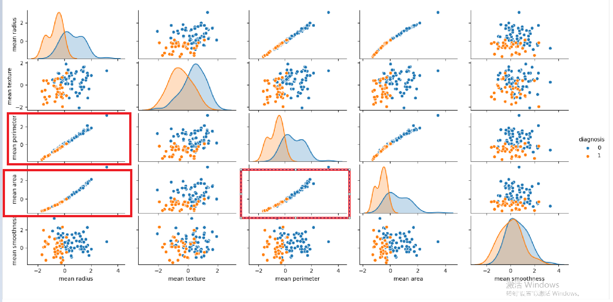

---
export_on_save:
 html: true
---

# 数据准备

在开始学习数据探索分析的过程中，有一个问题比较苦恼：数据可视化的代码部分容易理解，但是可视化之后的图形分析不太好理解。这篇内容记录的就是怎么样从可视化之后的图中分析我们需要找到的知识。

我们通过sklearn的“乳腺癌数据集”进行分析，首先我们导入数据。

```
import numpy as np
import pandas as pd
import seaborn as sns
import matplotlib.pyplot as plt
from sklearn.datasets import load_breast_cancer
from sklearn.preprocessing import StandardScaler

# 加载数据
bc = load_breast_cancer()

# 数据转为DataFrame, 方便操作
train_data = pd.DataFrame(columns=bc.feature_names, data=bc.data)
target_data = pd.DataFrame(columns=['diagnosis'], data=bc.target)

# 查看一下前5条数据
print(train_data.head())
```


分析之前，我们对数据做一下标准化处理：

```
ss = StandardScaler()
train_data = ss.fit_transform(train_data)
# ss标准化之后，返回的数据类型是np.ndarray
train_data = pd.DataFrame(columns=bc.feature_names, data=train_data)
# 将特征值和标签数据合并在一起
data = pd.concat([target_data, train_data], axis=1)
# 查看一下前5条数据
print(data.head())
```


数据已经准备好了，那么我们开始正式对数据进行一个图形化分析吧。

# 小提琴图

小提琴图是展示数据的分布和概率密度的，我们看图了解。

```
# 我们首先画单个特征值的小提琴图, 可以分析单个特征值与标签的关系
plt.figure(figsize=(10,10))
sns.violinplot(x=data['diagnosis'], y=data['mean radius'])
plt.show()
```


上图中是按照diagnosis标签值对mean radius这个特征值进行了一个数据统计展示，从图中可以得出：

1. 特征值mean radius集中分布在蓝线部分区域0的时候，标签为0；
2. 特征值mean radius集中分布在绿线部分区域1的时候，标签为1；

尽管蓝色部分和绿色部分有所交叉，但是大部分区域还是可以明显区分的，所以特征值mean radius对分类任务是具有比较不错的区分能力的。

```
# 展示所有特征值对分类的数据分布
# 宽数据->长数据
data2 = pd.melt(data.iloc[:, 0:6], id_vars=['diagnosis'], var_name='features', value_name='value')
plt.figure(figsize=(10, 10))
sns.violinplot(x='features', y='value', hue='diagnosis', data=data2, split=True, inner='quart')
# 刻度旋转90，避免重复
plt.xticks(rotation=90)
plt.show()
```


上图中展示的是前6个特征值的数据分布情况，小提琴的蓝色部分表示的是标签是0的数据分布，橙色部分表示的是标签是1的数据分布。从图中我们可以看到，三个绿色框所代表的特征值针对分类0、1的数据分布上下错开比较大，两个红色代表的特征值针对分类0、1的数据分布上下错开比较小，那么可以判定绿色的三个特征值对分类算法表达能力提升明显，而红色的特征值提升不明显。

另外，需要注意小提琴图中对类别要求两类，多分类的时候报错。

官方参考文档：https://seaborn.pydata.org/generated/seaborn.violinplot.html

# 箱线图

箱线图展示的一样也是数据分布，是根据数据分布的分位数展示的。这个图的主要作用是观察特征值是否有离群点，离群点也就是异常值。在数据分析中，通常需要对异常值进行处理，比如可以使用箱线图截尾或者删除的方式处理。

另外也可以根据箱线图对不同的数据批做整体分布的对比。

我们首先观察一个特征值的箱型图。

```
# 单个特征值的箱线图
plt.figure(figsize=(10,10))
# data.boxplot(['mean radius'])
sns.boxplot(x=data['diagnosis'], y=data['mean radius'])
plt.show()
```


1. 箱线图中可以观察到离群点异常值
2. 可以观察中位数的位置: 类别0的数据整体分布要大于类别1
3. 类别0的异常点分布在最大值侧，说明数据分布右偏
4. 类别1的异常点分布在两侧，异常点不是特别多的情况下，近似满足正太分布。当然也可以通过截尾的方式处理异常点

然后分别看下类别0/1的直方图分布，验证上面3,4两点。

```
data3 = data[data['diagnosis'] == 0]
data4 = data[data['diagnosis'] == 1]

plt.figure(figsize=(10,10))
plt.hist(x=data3['mean radius'])
plt.show()

plt.figure(figsize=(10,10))
plt.hist(x=data4['mean radius'])
plt.show()
```


左偏分布：数据分布集中在右侧，左侧尾部较长，即为左偏分布；
右偏分布：数据分布集中在左侧，右侧尾部较长，即为右偏分布。

下面我们观察一下，多个特征值的时候，箱线图的分布。

```
data5 = pd.melt(data.iloc[:, 0:6], id_vars=['diagnosis'], var_name='features', value_name='value')
plt.figure(figsize=(10,10))
sns.boxplot(x='features', y='value', hue='diagnosis', data=data5)
plt.xticks(rotation=30)
plt.show()
```


上面的这个示例不是很好，在多组特征值画箱线图的时候，是把多组单个特征值箱线图组合在一起了，没有起到箱线图对比的作用。

如果是数据以时间轴统计，那么用箱线图来对比是很合适的。比如比较中位线就可以比较每个月的数据增长程度。

参考资料:
[箱线图点位计算](https://www.sohu.com/a/220236877_434937)
[偏态分布](https://www.zhihu.com/question/61358774?sort=created)
[箱线图使用](https://blog.csdn.net/dujiahei/article/details/82056283)

# 散点矩阵图

散点矩阵图(Pairs Plot)主要是用来观察多组变量两两之间的关系的，通过两两变量的散点图可以看出这两个变量之间的相关性：正负相关或者无关。

首先画一个全部特征的散点矩阵图做一下简单的分析。

```
sns.pairplot(data=data.iloc[0:100, 0:6], hue='diagnosis')
plt.show()
```



1. 关注一下红色框中的三个散点图，类似一条直线，并且与x轴的夹角大于0小于90，说明两个特征正相关，且相关系数接近1.

2. 其他特征值的散点图分布呈椭圆状，并且两个半径接近，这个时候相关系数近似为0，说明两个特征无关。

3. 散点矩阵图的对角线上的图，描述的是单个特征值的数据分布图，可以看出是否满足正太分布，对类别0/1的分类有没有明显提升。

4. 如果要量化相关性，更加直观的分析相关系数的话，可以使用相关性热力图。

后续的思考：

1. 相关性很高的两个特征值在回归模型预测的时候，会带来什么问题吗？

两个相关性很高的特征值会对线性回归（最小二乘法）的参数预测带来很大的不确定性，这个问题叫做多重共线性。
***
多重共线性（Multicollinearity）是指线性回归模型中的自变量之间由于存在高度相关关系而使模型的权重参数估计失真或难以估计准确的一种特性，多重是指一个自变量可能与多个其他自变量之间存在相关关系。
***

2. 多重共线性与过拟合是不是一回事?

多重共线性是可能在训练集上表现好，但是测试集上表现差，导致模型泛化能力差，造成了过拟合。

另外，如果特征值选择很多或者模型很复杂的情况下，也会导致泛化能力差，造成过拟合。

所以，可以说共线性问题导致了过拟合问题的发生。同时也可以使用添加正则项解决共线性问题。

参考资料:
[散点矩阵图](https://blog.csdn.net/r6Auo52bK/article/details/80267718?utm_medium=distribute.pc_aggpage_search_result.none-task-blog-2~all~first_rank_v2~rank_v25-1-80267718.nonecase&utm_term=%E6%95%A3%E7%82%B9%E7%9F%A9%E9%98%B5%E5%9B%BE%E6%80%8E%E4%B9%88%E7%9C%8B%E6%87%82)
[皮尔逊相关系数](https://baike.baidu.com/item/%E7%9A%AE%E5%B0%94%E9%80%8A%E7%9B%B8%E5%85%B3%E7%B3%BB%E6%95%B0/12712835?fr=aladdin)
[多重共线性](https://www.sohu.com/a/275767539_814235)
[过拟合与多重共线性](https://www.zhihu.com/question/27269819)
